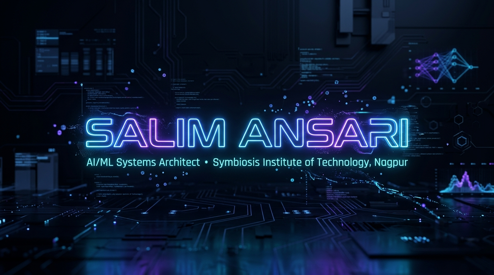
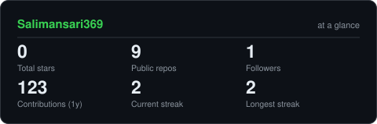
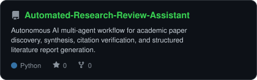
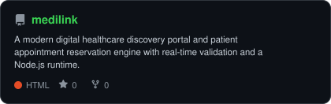
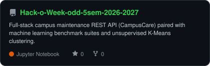
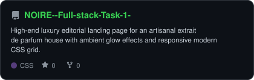

<div align="center">

<!-- HERO BANNER -->
<a href="https://github.com/Salimansari369">
  
</a>

<br><br>

<!-- NAME / TAGLINE - animated typing -->
<a href="https://github.com/Salimansari369">
  
</a>

<br>

<!-- SOCIALS & RESUME BUTTON -->
<a href="resume.pdf" download="Salim_Ansari_Resume.pdf"></a>
<a href="https://linkedin.com/in/"></a>
<a href="mailto:salimansari369@users.noreply.github.com"></a>
<a href="https://leetcode.com/"></a>
<a href="https://www.geeksforgeeks.org/"></a>
<a href="https://www.codechef.com/"></a>
<a href="https://www.hackerrank.com/"></a>

<br><br>


</div>

---

## `~/` whoami

```console
$ cat about.txt
```

Hi, I'm **Salim Ansari**. I build things that sit somewhere between autonomous artificial intelligence and modern web architectures, and I solve engineering challenges for fun when neither is cooperating.

* 🎓 **B.Tech Computer Science & Engineering (AI & ML)** @ **Symbiosis Institute of Technology (SIT), Nagpur**
* 🏛️ **Symbiosis International (Deemed University)**
* 🤖 Currently building **[Automated Research Review Assistant](https://github.com/Salimansari369/Automated-Research-Review-Assistant)** and **[MediLinks](https://github.com/Salimansari369/medilink)**
* 💼 Software & AI Engineering Intern (**Maincrafts**) • Author of Applied AI Research (**Springer**)
* ⚡ Learning **Multi-Agent Systems + Large Language Model Orchestration**
* 💡 Fun fact: **I started coding seriously because I wanted to build intelligent systems I wished existed.**

<br>

<div align="center">


</div>

<br>

<div align="center">

## `~/` toolbox


</div>

---

<div align="center">

## `~/` skill radar

<table>
<tr>
<td width="50%" align="center" valign="middle">

<!-- Self-rated radar generated by scripts/radar.py -->
<picture>
  <source media="(prefers-color-scheme: dark)"  srcset="assets/radar-dark.svg">
  <source media="(prefers-color-scheme: light)" srcset="assets/radar-light.svg">
  
</picture>

</td>
<td width="50%" align="center" valign="middle">

<!-- Live radar built from real language byte counts across public repos -->
<picture>
  <source media="(prefers-color-scheme: dark)"  srcset="assets/radar-langs-dark.svg">
  <source media="(prefers-color-scheme: light)" srcset="assets/radar-langs-light.svg">
  
</picture>

</td>
</tr>
</table>

</div>

---

<div align="center">

## `~/` contribution calendar

<!-- 3D isometric calendar -->


<br><br>

<!-- Pacman & Retro Arcade Animation -->


</div>

---

<div align="center">

## `~/` the numbers

<!-- Self-hosted stats card generated by scripts/cards.py -->
<picture>
  <source media="(prefers-color-scheme: dark)"  srcset="assets/card-stats-dark.svg">
  <source media="(prefers-color-scheme: light)" srcset="assets/card-stats-light.svg">
  
</picture>

<br>


<br><br>


</div>

---

<div align="center">

## `~/` selected work

<!-- Cards generated by scripts/cards.py from assets/projects.json -->
<table>
<tr>
<td width="50%">
  <a href="https://github.com/Salimansari369/Automated-Research-Review-Assistant">
    <picture>
      <source media="(prefers-color-scheme: dark)"  srcset="assets/card-Automated-Research-Review-Assistant-dark.svg">
      <source media="(prefers-color-scheme: light)" srcset="assets/card-Automated-Research-Review-Assistant-light.svg">
      
    </picture>
  </a>
</td>
<td width="50%">
  <a href="https://github.com/Salimansari369/medilink">
    <picture>
      <source media="(prefers-color-scheme: dark)"  srcset="assets/card-medilink-dark.svg">
      <source media="(prefers-color-scheme: light)" srcset="assets/card-medilink-light.svg">
      
    </picture>
  </a>
</td>
</tr>
<tr>
<td width="50%">
  <a href="https://github.com/Salimansari369/Hack-o-Week-odd-5sem-2026-2027">
    <picture>
      <source media="(prefers-color-scheme: dark)"  srcset="assets/card-Hack-o-Week-odd-5sem-2026-2027-dark.svg">
      <source media="(prefers-color-scheme: light)" srcset="assets/card-Hack-o-Week-odd-5sem-2026-2027-light.svg">
      
    </picture>
  </a>
</td>
<td width="50%">
  <a href="https://github.com/Salimansari369/NOIRE--Full-stack-Task-1-">
    <picture>
      <source media="(prefers-color-scheme: dark)"  srcset="assets/card-NOIRE--Full-stack-Task-1--dark.svg">
      <source media="(prefers-color-scheme: light)" srcset="assets/card-NOIRE--Full-stack-Task-1--light.svg">
      
    </picture>
  </a>
</td>
</tr>
</table>

<sub>

| project | category | stack |
|---|---|---|
| **[Automated Research Review Assistant](https://github.com/Salimansari369/Automated-Research-Review-Assistant)** | Autonomous AI | `Python` `Gradio` `Agentic AI` `LLMs` |
| **[MediLinks](https://github.com/Salimansari369/medilink)** | Healthcare Portal | `JavaScript` `Node.js` `HTML5` `CSS3` |
| **[CampusCare](https://github.com/Salimansari369/Hack-o-Week-odd-5sem-2026-2027)** | Facility REST API | `Python` `Flask` `SQLite` `REST` |
| **[NOIRÉ](https://github.com/Salimansari369/NOIRE--Full-stack-Task-1-)** | Luxury Editorial Web | `Semantic HTML5` `CSS Grid` `UI/UX` |

</sub>

</div>

---

<div align="center">

<sub>`01110100 01101000 01100001 01101110 01101011 01110011 00100000 01100110 01101111 01110010 00100000 01110011 01100011 01110010 01101111 01101100 01101100 01101001 01101110 01100111`</sub>

<br><br>

*"Great engineers don't just write code; they design systems that think, scale, and endure."* ⚡

</div>
